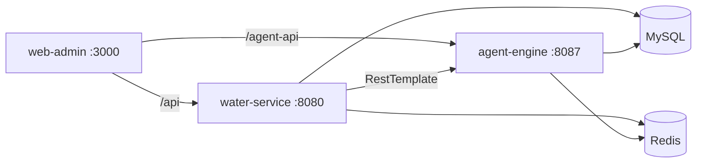

# 基于人工智能的水表抄表收费管理系统

> 可对照代码库的项目说明书：各端技术栈、目录映射、已实现能力与不足清单

---

## 一、项目概述

本项目面向水务抄表收费场景，目标是构建「管理端 + 业务后端 + 多智能体 AI 引擎」的智能化抄表收费系统。仓库中已具备多智能体演示框架、部分 Spring Boot 业务接口、Vue 管理端页面壳，以及 MySQL 建库脚本与中间件编排；**尚未达到文档早期宣称的「完整微服务 / 全栈生产就绪」状态**。

### 当前真实定位

| 能力 | 状态 |
|------|------|
| 多智能体框架与 Flask API | 已实现（演示级，AI 多为模拟） |
| 业务后端（抄表 / 计费） | 部分实现 |
| Web 管理端 UI | 页面壳 + Mock 数据，未真正联调 |
| 数据库 schema / 种子数据 | 较完整 |
| 基础设施 Docker Compose | 仅中间件，不含应用服务 |
| 移动 APP / 微信小程序 / API 网关 / 设备接入 | 无代码 |

---

## 二、仓库布局总览

以外层目录为**权威源**。内层同名文件夹 `基于人工智能的水表抄表收费管理系统/` 是核心模块的副本，存在维护漂移风险，建议后续去重。

| 目录 / 文件 | 对应端 / 职责 | 状态 |
|-------------|---------------|------|
| `web-admin/` | Web 管理端（真实产品 UI） | 页面壳 + Mock 数据 |
| `admin-web/` | 废弃 Vite 脚手架 | 未使用，可清理 |
| `water-service/` | Java 业务后端 | 仅抄表 + 计费部分实现 |
| `agent-engine/` | AI 多智能体引擎 | 框架完整，AI 多为模拟 |
| `database/` | MySQL 建库与种子数据 | schema 较完整 |
| `docker-compose.yml` | 基础设施编排 | 仅中间件，无应用服务 |
| `基于人工智能的水表抄表收费管理系统/` | 核心模块嵌套副本 | 维护负担，建议去重 |
| `需求.txt` | 需求背景说明 | 文稿不完整（末尾截断） |
| `.venv/` | 本地 Python 虚拟环境 | 开发用，非产品代码 |

---

## 三、系统架构（规划 vs 已落地）

```
┌─────────────────────────────────────────────────────────────┐
│                      展 示 层                                │
│   Web管理端 │ 移动APP │ 微信小程序 │ 数据大屏               │
├─────────────────────────────────────────────────────────────┤
│                      接 入 层                                │
│   API网关 │ 负载均衡 │ 身份认证 │ 限流熔断                  │
├─────────────────────────────────────────────────────────────┤
│                   业 务 服 务 层                             │
│   抄表服务 │ 计费服务 │ 缴费服务 │ 用户服务 │ 报表服务      │
├─────────────────────────────────────────────────────────────┤
│                   AI 智 能 体 层                            │
│  抄表 │ 计费 │ 异常 │ 催缴 │ 分析  +  协调器 Orchestrator  │
├─────────────────────────────────────────────────────────────┤
│                      数 据 层                                │
│   MySQL │ Redis │ InfluxDB │ MinIO │ Kafka │ Elasticsearch │
├─────────────────────────────────────────────────────────────┤
│                   设 备 接 入 层                             │
│   NB-IoT水表 │ LoRa水表 │ 4G摄像头 │ MQTT协议              │
└─────────────────────────────────────────────────────────────┘
```

### 已落地

- **展示层**：`web-admin`（Mock UI）；无独立大屏应用、无 APP/小程序
- **业务层**：`water-service` 单体中仅有抄表、计费 Controller（非完整微服务拆分）
- **AI 层**：`agent-engine` 五智能体 + 协调器 + Flask API
- **数据层（中间件）**：Compose 中有 MySQL、Redis、InfluxDB、MinIO、Nacos；`database/init.sql` 已建表
- **后端 → AI**：`water-service` 经 RestTemplate 调用 `agent-engine`（默认 `http://localhost:8087`）

### 未落地

- API 网关 / 负载均衡 / 限流熔断服务
- 移动 APP、微信小程序、独立数据大屏产品
- 缴费、用户管理、异常工单、报表等完整后端 API
- Kafka、Elasticsearch 容器与对应业务代码
- NB-IoT / LoRa / MQTT 设备接入层
- JWT 鉴权、真实 OCR / LSTM / Isolation Forest 等生产 AI

### 运行时调用关系（当前）



> 说明：管理端已配置代理，但多数页面仍使用本地 Mock，实际联调链路尚未打通。

---

## 四、各端技术栈 ↔ 文件夹

### 4.1 Web 管理端 — `web-admin/`

| 项 | 内容 |
|----|------|
| **技术栈** | Vue 3.4、Vue Router 4、Pinia、Element Plus、Axios、ECharts、Dayjs、NProgress；构建：Vite 5、Sass、unplugin-auto-import / components |
| **端口** | 开发 `:3000`；代理 `/api` → `:8080`，`/agent-api` → `:8087` |
| **关键目录** | `src/views/`（dashboard、meter、bill、anomaly、user、report、Login、Layout）、`src/api/index.js`、`src/router/`、`vite.config.js` |
| **实际完成度** | 路由与页面壳齐全；列表/仪表盘多为硬编码；登录为模拟 token；`bill/Payment.vue`、`anomaly/WorkOrder.vue` 为「开发中」；`src/stores/`、`components/`、`utils/` 基本为空；`api/index.js` 未被 views 引用 |

### 4.2 废弃脚手架 — `admin-web/`

| 项 | 内容 |
|----|------|
| **技术栈** | Vue 3 + Vite（create-vue 默认模板） |
| **用途** | 非产品 UI，勿与 `web-admin` 混淆 |
| **建议** | 删除或归档，避免新人找错目录 |

### 4.3 业务后端 — `water-service/`

| 项 | 内容 |
|----|------|
| **技术栈（pom 声明）** | Spring Boot 3.2、Java 17、Spring Cloud 2023、Nacos Discovery、OpenFeign、MyBatis-Plus、MySQL、Redis/Redisson、Elasticsearch、Kafka、InfluxDB Client、MinIO、Knife4j、JWT、MapStruct、Lombok、Hutool |
| **端口** | `:8080` |
| **关键目录** | `controller/`（MeterReading、Billing）、`service/impl/`、`mapper/`（User、WaterMeter、MeterReading、Bill）、`entity/`（含 AnomalyRecord、WorkOrder 但无对应 Mapper/Service）、`config/`、`application.yml` |
| **已实现** | 抄表相关 API；计费相关 API；抄表服务通过 RestTemplate 调用 agent-engine |
| **不足** | 无用户/水表 CRUD、异常、工单、鉴权、缴费、报表 Controller；Anomaly/WorkOrder 仅有实体；MinIO 上传为空串占位；Kafka/ES/Influx/Feign/JWT 等多为依赖声明、业务未用；测试目录空；未纳入 `docker-compose.yml` |

### 4.4 AI 智能体引擎 — `agent-engine/`

| 项 | 内容 |
|----|------|
| **技术栈** | Python、Flask / flask-cors / flask-restful、SQLAlchemy、Redis、numpy / pandas / scikit-learn、paddleocr + paddlepaddle、OpenCV、Pillow、kafka-python、influxdb-client、APScheduler、pydantic、loguru |
| **纠正** | 旧文档写「PyTorch」——**`requirements.txt` 中无 PyTorch** |
| **端口** | `:8087` |
| **关键目录** | `core/`（`base_agent.py`、`orchestrator.py`、`knowledge_base.py`、`event_bus.py`）、`agents/`（五个智能体）、`api/routes.py`、`main.py`；`models/`、`utils/` 为空目录 |
| **智能体** | 抄表、计费、异常、催缴、分析；协调器负责任务调度与工作流 |
| **内置工作流** | `reading_billing_workflow`、`anomaly_handling_workflow`、`collection_workflow` |
| **实际完成度** | 框架与 HTTP API（约 20+）可演示；OCR / 深度异常 / 时序预测等为模拟或启发式，非真实模型推理 |

### 4.5 数据层 — `database/`

| 项 | 内容 |
|----|------|
| **技术** | MySQL 8 脚本 |
| **文件** | `database/init.sql`（Compose 挂载到 MySQL 初始化） |
| **表** | `area`、`sys_user`、`water_meter`、`meter_reading`、`bill`、`anomaly_record`、`work_order`、`collection_record`、`water_usage_stats`、`sys_config` |
| **附加** | 视图、阶梯水费存储过程、种子用户/水表/配置 |
| **完成度** | Schema 与种子较完整；应用侧写入/查询覆盖不全 |

### 4.6 基础设施 — `docker-compose.yml`

| 服务 | 镜像 / 端口 | 用途 |
|------|-------------|------|
| mysql | mysql:8.0 → `3306` | 业务库（自动执行 `init.sql`） |
| redis | redis:7-alpine → `6379` | 缓存 |
| influxdb | influxdb:2.7 → `8086` | 时序用量（业务尚未充分使用） |
| minio | minio → `9000`/`9001` | 对象存储（上传逻辑未打通） |
| nacos | nacos-server:v2.3.0 → `8848` | 注册中心（微服务拆分未完成） |

**Compose 未包含**：`water-service`、`agent-engine`、`web-admin`、Kafka、Elasticsearch。

### 4.7 技术栈分端速查

| 端 | 文件夹 | 主技术 | 默认端口 |
|----|--------|--------|----------|
| Web 管理端 | `web-admin/` | Vue3 + Element Plus + ECharts + Vite | 3000 |
| 业务后端 | `water-service/` | Spring Boot 3 + MyBatis-Plus | 8080 |
| AI 引擎 | `agent-engine/` | Python + Flask + PaddleOCR（依赖已声明） | 8087 |
| 数据库脚本 | `database/` | MySQL SQL | — |
| 中间件 | `docker-compose.yml` | MySQL / Redis / InfluxDB / MinIO / Nacos | 见上表 |
| （废弃）脚手架 | `admin-web/` | Vue3 + Vite 模板 | — |

---

## 五、已实现能力（分模块）

### 5.1 agent-engine（相对最完整）

| 模块 | 路径 | 说明 |
|------|------|------|
| 智能体基类 | `core/base_agent.py` | 感知 → 决策 → 执行周期 |
| 协调器 | `core/orchestrator.py` | 注册、调度、工作流、消息路由 |
| 知识库 / 事件总线 | `core/knowledge_base.py`、`event_bus.py` | 共享规则与发布订阅 |
| 五智能体 | `agents/*.py` | 抄表、计费、异常、催缴、分析 |
| HTTP API | `api/routes.py` | REST 接口（抄表、异常检测等） |
| 入口 | `main.py` | 初始化智能体并启动 Flask |

可通过 `python main.py` 跑通演示流程（结果为演示数据/模拟推理）。

### 5.2 water-service（部分）

| 能力 | 证据 |
|------|------|
| 抄表 API | `MeterReadingController` + `MeterReadingServiceImpl` |
| 计费 API | `BillingController` + `BillServiceImpl` |
| 调用 AI | RestTemplate → `agent-engine.url` |
| 实体建模 | User、WaterMeter、MeterReading、Bill、AnomalyRecord、WorkOrder |
| Mapper | User、WaterMeter、MeterReading、Bill（异常/工单缺 Mapper） |

### 5.3 web-admin（UI 壳）

| 页面 | 路径 | 说明 |
|------|------|------|
| 登录 / 布局 | `Login.vue`、`Layout.vue` | 模拟登录 |
| 仪表盘 | `dashboard/Index.vue` | 硬编码统计与图表数据 |
| 水表 / 抄表 | `meter/List.vue`、`Reading.vue` | Mock 表格；含模拟 AI 识别 |
| 账单 / 缴费 | `bill/List.vue`、`Payment.vue` | 列表 Mock；缴费页开发中 |
| 异常 / 工单 | `anomaly/List.vue`、`WorkOrder.vue` | 列表 Mock；工单页开发中 |
| 用户 / 报表 | `user/List.vue`、`report/Index.vue` | Mock / 硬编码 |

### 5.4 database

十张核心业务表 + 配置表、种子数据、视图与阶梯计费过程已就绪，可作为联调基础。

---

## 六、不足与待完善（按优先级）

### P0 — 打通联调闭环

1. `web-admin` 各页面改为调用 `src/api`，去掉硬编码 / Mock
2. 登录改为真实鉴权（后端 JWT 或 Session），替换 `mock-token`
3. 补齐 `Payment`、`WorkOrder` 页面与对应后端接口

### P1 — 补齐业务后端

1. 用户、水表 CRUD、异常记录、工单、催缴、报表、缴费接口
2. 为 `AnomalyRecord`、`WorkOrder` 补 Mapper / Service / Controller
3. MinIO 真实上传抄表图片（替换空 `imageUrl`）
4. 启用或删除未使用依赖（Kafka、ES、Influx、Feign 等），避免「虚假完备」
5. 补充单元 / 接口测试

### P2 — AI 去模拟、可落地

1. 接入真实 PaddleOCR（当前抄表智能体为模拟 OCR）
2. 异常三层中的 AI 深度检测改为真实模型（如 Isolation Forest 等）
3. 分析智能体接入真实时序预测（LSTM / 等价方案），填充 `models/`
4. 催缴 / 分析减少内存假数据，改为读库或调业务服务

### P3 — 部署与产品缺口

1. `docker-compose` 增加 `water-service`、`agent-engine`、前端（或 Nginx）服务
2. 按需增加 Kafka / ES，或从架构图与 pom 中下调承诺
3. 移动 APP / 微信小程序、API 网关、设备 MQTT 接入：目前零代码，需单独立项
4. 仓库卫生：归档 `admin-web/`；去除或停止维护嵌套重复目录；保持本 overview 与代码一致

### 与旧 Phase 规划对齐

| 阶段 | 旧文档状态 | 现状修正 |
|------|------------|----------|
| Phase 2 AI 能力 | 未勾选 | 仍成立：真实 OCR / LSTM / Isolation Forest 未接 |
| Phase 3 业务服务 | 勾选「待做 Spring / MySQL / Redis」 | **部分完成**：有 `water-service` + `init.sql` + Compose 中间件，但业务覆盖不全 |
| Phase 4 前端 | 勾选「待做 Vue3」 | **部分完成**：`web-admin` 壳已有，未接 API；APP/小程序仍无 |

---

## 七、快速开始

### 1. 启动中间件

```bash
docker compose up -d
```

将拉起 MySQL（自动执行 `database/init.sql`）、Redis、InfluxDB、MinIO、Nacos。

### 2. 启动 AI 引擎（:8087）

```bash
cd agent-engine
pip install -r requirements.txt
python main.py
```

### 3. 启动业务后端（:8080）

```bash
cd water-service
# 需本机 JDK 17+ / Maven；确认 application.yml 中数据库与 agent-engine.url
mvn spring-boot:run
```

### 4. 启动管理端（:3000）

```bash
cd web-admin
npm install
npm run dev
```

浏览器访问 `http://localhost:3000`。在页面改为真实 API 调用之前，多数列表仍显示 Mock 数据。

### API 调用示例（agent-engine）

```bash
# 图像抄表（演示）
curl -X POST http://localhost:8087/api/meter-reading \
  -H "Content-Type: application/json" \
  -d "{\"mode\": \"image\", \"meter_id\": \"WM-001\"}"

# 异常检测（演示）
curl -X POST http://localhost:8087/api/anomaly/detect \
  -H "Content-Type: application/json" \
  -d "{\"meter_id\": \"WM-001\", \"current_usage\": 150}"
```

---

## 八、模块清单（便于对照仓库）

| 模块 | 主要路径 | 备注 |
|------|----------|------|
| 管理端 | `web-admin/` | 产品 UI；非 `admin-web/` |
| 后端 | `water-service/src/main/java/com/water/ai/meter/` | 单体，非多微服务工程 |
| AI | `agent-engine/{core,agents,api}/` | 约 14 个 Python 源文件 |
| 库表 | `database/init.sql` | 10 张业务/配置表 |
| 编排 | `docker-compose.yml` | 5 个中间件服务 |

---

**结论**：多智能体核心与库表基础已具备，业务后端与管理端处于「可演示、未闭环」阶段；生产级 OCR/预测、完整业务 API、前后端联调、一键应用部署以及移动端/网关/设备层仍待完善。本文件以外层仓库为准，修改后请同步嵌套副本中的同名文档。
)
