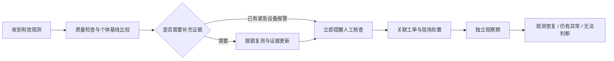

# 水慧云：主动诊断与处置效果核验实施方案（核验稿 v1）

> **实施授权：** 用户已确认“可以实施”，本文件保留原核验方案作为追溯依据。实际交付、实现差异和实验结果见 `docs/innovation-implementation.md`，验证记录见 `docs/innovation-acceptance.md`。按 executing-plans 推进，不将方案目标当作已测结果。

**Goal:** 建成“有依据地发现异常、主动补充观测、推动人工处置、核验恢复情况”的可追溯业务流程，并用可重复实验评估效果。

**Architecture:** 保留 Vue + Spring Boot + Flask + MySQL。Java 负责鉴权、数据校验、业务状态与任务执行；Python 负责特征分析和模型推理；MySQL 保存观测、诊断证据、任务和评估记录。新增诊断观测通道，与现有正式抄表、年度计费和支付流水隔离。

**Tech Stack:** Vue 3、Element Plus、ECharts、Java 21、Spring Boot、MySQL 8、Python 现有虚拟环境、NumPy；增加经过环境兼容验证并锁定版本的 scikit-learn 作为可选 ML 依赖。模型不可用时保留规则判定。

**状态：已实施 I1—I4 的模拟流程，效果门槛未通过，默认关闭诊断。** 下文原始清单是设计与验收目标；完成依据以实施说明和验收报告为准。演练采用独立文件服务，复测采用恒流模拟器，未接入真实设备。I5仍属二期。

---

## 1. 核验范围与实施优先级

推荐一期完成三个业务能力和一个验证工具：

| 编号 | 能力 | 具体交付 | 核验价值 |
|---|---|---|---|
| I1 | 个性化异常检测 | 每表基线、真实模型评分、证据卡、冷启动/数据不足说明 | 相比固定阈值，是否减少误报或发现更多异常 |
| I2 | 主动复测 | 有上限的复测任务、重试、去重、取消及恢复 | 系统能否主动获取新证据，且不扰动账务 |
| I3 | 维修后效果核验 | 工单完工后的观察记录、恢复/仍异常/无法判断三个结论 | “填写完成”之后是否有数据证据支持恢复 |
| I4 | 故障演练与对比 | 独立沙盘、固定场景、回放、指标导出 | 创新效果是否可重复验证 |

二期扩展 I5：用户水费试算与管理员政策验证，详见第12节；不作为一期交付的前置条件。

一期不加入自由对话大模型、真实关阀、自动改价、自动扣款、短信或微信发送。这些动作不属于本方案的执行范围。智能助手只读诊断证据并给出对应页面入口。

## 2. 已有能力与必须先解决的约束

项目根目录：`D:/AI-based water meter reading and fee management system/ccb`。

代码核对发现：

1. `D:/AI-based water meter reading and fee management system/ccb/water-service/src/main/java/com/water/ai/meter/automation/CollectionService.java` 的 `accept()` 将采集、累计读数更新、异常落库、自动出账放在同一事务；不能用该入口直接实现每5分钟诊断复测。
2. 同文件的模拟器每次增加固定用量，任务创建时就固化报文。提高采集频率会改变模拟总用量，重试同一报文也不是取得新观测。诊断模拟器须按虚拟时间推进流量与累计量。
3. `D:/AI-based water meter reading and fee management system/ccb/water-service/src/main/java/com/water/ai/meter/automation/DeviceReport.java` 已校验七字段、时间范围和异常阈值，但历史流量主要存在原始报文中。需新增可查询的结构化观测，不能从月度用量虚构夜间连续流量。
4. `D:/AI-based water meter reading and fee management system/ccb/water-service/src/main/java/com/water/ai/meter/controller/WorkOrderController.java` 当前完成工单会同步告警为已处理。效果核验应增加独立状态，保留现有工单完成记录及责任边界。
5. 现有 Python 依赖没有强制安装 scikit-learn；学习模型是本方案新增项，不能沿用旧随机预测结果作为模型输出。

以上约束决定实施顺序：先数据与账务隔离，再诊断与复测，最后上线模型与核验。

## 3. 用户看到的流程



示例为拟定演示数据：某居民表夜间多次出现0.12 m³/h流量，历史同类时段通常较低。系统展示具体历史区间、当次报文与数据完整度，安排三次复测。持续偏高时建议巡检；人员记录“已修复漏点”后，系统观察后续数据并展示是否恢复。

页面只称“疑似异常”“观察期内恢复”，不会仅凭用水曲线断言真实漏水或已经彻底修复。

## 4. 数据通道、事务与持久化

### 4.1 正式抄表与诊断观测分开

- **正式通道：** 继续现有审核读数、计费游标和出账规则。新诊断功能关闭时行为保持兼容。
- **诊断通道：** 只写观测、质量结果和诊断任务；不写 `bill`、`bill_payment`、`tariff_year_balance`，不改 `water_meter.current_reading` 或正式抄表时间。
- **沙盘通道：** 使用独立数据库与进程配置，不能通过请求体传入数据库名切换到业务库。
- 常规采集成功可在现有事务内同时写入观测及待分析任务；模型调用在事务提交后执行。模型超时不会回滚正式出账。
- 诊断复测的累计数高于正式抄表游标是允许的；下一次正式读数仍从正式游标计算用量。例如正式读数100、诊断101/102、下次正式103，只结算新增3，不漏算、不重复。
- 同一表号、设备时刻、来源相同的报文只保存一个有效观测。重复内容不增加证据样本；同键不同内容记录为冲突，不覆盖旧证据。
- 接收尝试先单独落审计，再关联成功提交的观测；解析/计费事务失败只能记录失败原因，不能把回滚掉的观测标成已接受。同一正式报文已生成的硬规则告警由诊断事件引用，按观测ID与异常类型建立映射，不能再生成一份重复告警。
- 每次接收保留校验结果；倒退、冲突、乱序不能推进有效观测游标。诊断与正式通道共享短时表级校验锁，保证同刻冲突一致；正式账务游标与诊断观测游标分别维护。
- 已验证来源和采集目的由服务端入口/任务确定，客户端不能把普通请求标成可信设备或已审核账单。

### 4.2 拟新增表

| 表 | 核心字段 | 唯一约束/用途 |
|---|---|---|
| `meter_observation` | id、meter_id、source、reported_at、received_at、flow、total、temperature、valve、alarm、packet_hash、quality_status | `(meter_id,source,reported_at)`；有效原始观测，不直接计费 |
| `observation_attempt` | request_key、observation_id、purpose、packet_hash、validation_code、received_at、actor | 请求去重；保留重复/冲突/拒收原因；原文限500字符 |
| `observation_cursor` | meter_id、source、last_valid_at、last_valid_total | `(meter_id,source)`；与正式账务游标分开 |
| `diagnosis_job` | observation_id、policy_version、state、attempts、next_at、lease_until、last_error | `(observation_id,policy_version)`；事务后分析、宕机恢复 |
| `meter_baseline` | meter_id、version、feature_schema、training_start/end、valid_count、coverage、baseline_json | `(meter_id,version)`；基线快照可追溯 |
| `diagnosis_case` | meter_id、family、state、severity、policy_version、model_version、opened_at、last_evidence_at、anomaly_id | 诊断事件，合并连续同类异常 |
| `diagnosis_case_guard` | meter_id、family、active_case_id | `(meter_id,family)`；锁定活动事件，防止并发重复建案 |
| `diagnosis_evidence` | case_id、observation_id、window_end、baseline_version、features_json、score、reason_codes、created_at | 同一案同一窗口同版本只写一次；证据不原地改写 |
| `diagnostic_probe` | case_id、sequence_no、due_at、attempts、state、lease_until、observation_id、error | `(case_id,sequence_no)`；复测与重试分别计数 |
| `work_order_verification` | work_order_id、revision、state、started_at、deadline_at、policy_snapshot、baseline_snapshot、evidence_json、followup_anomaly_id、followup_order_id | `(work_order_id,revision)`；结论历史保留，复检引用独立保存 |
| `diagnosis_review` | case_id、reviewer_id、label、note、created_at、supersedes_id | 人工标签追加修订；不直接触发在线训练 |
| `diagnosis_policy` | version、mode、scope、thresholds_json、created_by、created_at | `off/shadow/assisted`；保存生效范围和参数快照 |
| `diagnosis_model` | version、artifact_hash、feature_schema、data_version、metrics_json、state | 模型文件只从服务端受控目录加载 |

沙盘库另有 `replay_run`、`replay_truth`、`replay_metric`，保存配置、种子、事件真值和指标；真值标签不传入业务检测器。

所有时间按北京时间业务口径处理，API使用带偏移的ISO格式；累计量/金额使用定点数。SQL索引至少覆盖 `(meter_id,reported_at)`、任务 `(state,next_at)`、事件 `(state,last_evidence_at)`。列表必须分页，不能一次返回全部历史观测。

## 5. I1：个性化异常检测

### 5.1 数据质量与冷启动

第一版先支持通信失败、设备告警、高流量、持续偏高用水四类诊断；“真实漏水”保留人工确认。

| 条件 | 拟定处理 |
|---|---|
| 表具停用/未绑定用户 | 停止新增诊断任务，保留历史 |
| 重复、时间冲突、倒退读数 | 独立质量事件，不作为新的有效用水证据 |
| 无足够历史 | 显示“基础规则模式”；不显示个性化置信度 |
| 过去28天内至少14个有效日且至少200个有效区间 | 可建立个体基线；每个时段分组另需至少8个历史样本 |
| 某窗口观测不足或相邻间隔超过30分钟 | 当前窗口弃权，标注缺失；不能把缺失当成零用水 |
| Python/模型不可用 | 记录降级原因，继续设备硬规则；不生成随机分数 |

上述样本门槛是一期配置初值，需要用验证集检查适用性；没有足够历史的现有表会真实显示冷启动状态。

### 5.2 特征、方法与解释

- 从相邻有效累计读数及真实时间差计算区间平均流量，仅在间隔合格时使用。瞬时流量与区间平均流量分别显示，不能混作同一测量。
- 个体基线按“工作日/周末 × 4小时时段”分组，保存中位数、MAD、历史分位数、样本数。没有足够同组样本时降级，不借用其他用户的绝对用量。
- 模型特征包括：相对个体基线的区间流量偏离、瞬时流量偏离、最近有效窗口变化率、连续偏高次数、设备状态、观测完整度。时段特征只使用事件当时可获得的信息。
- 一期采用“确定性硬规则 + 稳健个体基线 + Isolation Forest 候选模型”。先实现并保留前两者，再比较增加模型是否有效。
- 拟定模型初值：`n_estimators=200`、`max_samples=256`、`contamination='auto'`、固定实验种子；真正告警阈值由独立验证集选定并随版本冻结。不得把 contamination 当作已经知道的实际异常率。
- 连续偏高的初始合并规则：连续3个合格的15分钟窗口触发待核查事件；缺失窗口不能当正常，也不能补齐触发条件。硬设备报警不等待这3个窗口。
- Isolation Forest 返回异常评分，不直接作为“漏水概率”。证据卡解释来自明确的观测偏离、规则与样本覆盖；不宣称这些文字是模型因果解释。

Isolation Forest的接口与分数含义以[官方文档](https://scikit-learn.org/stable/modules/generated/sklearn.ensemble.IsolationForest.html)为依据。版本在现有Python环境完成安装、训练/加载兼容测试后锁定，随模型保存依赖清单。

### 5.3 证据卡

每张卡必须包含：表号、数据来源、时间窗口、实际值、同类历史范围、有效样本数、缺失情况、命中理由、模型/基线/规则版本、复测进度、建议动作、关联原始报文和工单。

“异常评分”“数据完整度”“人工结论”分开展示。用户端只展示自己水表的简化提醒，不暴露其他用户样本或内部模型文件路径。

## 6. I2：主动复测

### 6.1 自动化边界与默认值

| 项目 | 拟定默认值 |
|---|---|
| 启用模式 | 默认 `off`；先在沙盘演练，再对管理员选定的表开启 `shadow` |
| `shadow` | 记录诊断建议，不额外采集、不新增正式告警/工单 |
| `assisted` | 可创建诊断复测和关联告警；工单派发与结案由管理员操作 |
| 复测时间 | 首次候选异常后第5、15、30分钟各取得一次新观测 |
| 网络重试 | 每次复测最多重试1次，间隔60秒；失败不能伪装正常 |
| 单事件预算 | 最多3次复测、6次设备请求（含重试） |
| 单表日预算 | 最多24次额外设备请求，按北京时间自然日，预占后执行 |
| 同类冷却 | 6小时内合并同表同类候选事件；已有活动事件优先追加证据 |
| 调度限制 | 全局最多10个在途请求；任务租约60秒，单请求超时5秒 |
| 停止条件 | 管理员关闭策略、取消任务、表具停用、预算耗尽、事件已进入人工处置 |

一期执行的是模拟采集适配器，界面标明来源；真实设备接入后须重新核对设备允许的采样频率和通讯成本。

### 6.2 事件与任务状态

事件：`candidate → probing → needs_review → work_order_linked → awaiting_verification → closed`。

- 候选未持续：可以结束为 `not_persistent`，保留证据，不写“确认无漏水”。
- 数据不足、全部失败、超预算：进入 `needs_review` 并说明原因，不能自动结束为正常。
- 严重设备报警：直接通知并进入 `needs_review`，复测不能延迟提醒。
- 复测任务：`pending → running → success/retry/failed/cancelled`；重启后回收过期租约。取消阻止未发送任务；已在途响应仍保留审计，但不继续派生任务。
- 并发调度先锁活动事件及预算行，再持久化任务；请求号与任务号固定，服务重试不会创建第二组复测。
- 关闭策略只停止本模块新增/待执行动作，不暂停原有正式采集计划，也不删除观察历史。

## 7. I3：维修后效果核验

保留工单“已完成”和告警“已处理”状态，新增独立字段“效果待观察”。不得因新增功能批量改写过去的工单。

1. 管理员完成关联诊断事件的工单时，在同一事务创建一次效果核验记录。唯一约束保证重复提交不会生成多份观察任务。
2. 快照保存维修前基线、原异常类型和核验规则。不能把维修后的异常数据重新训练为正常，再用它证明维修成功。
3. 默认观察24小时，优先使用常规观测；缺少足够频率时可在既定预算内补测，否则显示数据不足。
4. 拟定充分性要求：15分钟格的覆盖率至少90%、最大观测空档不超过30分钟；夜间异常必须覆盖对应夜间时段。快照规则按实际适用异常类型计算，不把所有问题套成同一用量阈值。
5. “观测恢复”：达到观察时长与覆盖要求，原异常不再触发，且至少90%的可比较窗口回到原基线范围；设备故障还要求相应报警解除。
6. “仍有异常”：出现新的硬设备报警或连续合格窗口仍满足原异常条件，通知管理员复核。原工单保留；可以确认后创建关联复检工单，不自动重写原工单结果。
7. “无法判断”：最多延长至72小时仍缺数据；停表、换表、基线失效也进入此状态，说明具体原因。

新增复检不能直接复用当前“同告警只生成一个工单”的入口。管理员确认后锁定核验记录，创建关联的新告警及复检工单，将新ID写入 `followup_anomaly_id/followup_order_id`；重复确认返回原复检单。原告警、原工单和原处置结论不被重新打开或覆盖。诊断事件由 `awaiting_verification` 转回 `needs_review`，确认复检后重新进入工单关联状态；观察恢复才进入 `closed`。

判断恢复还要求观测条件可比：阀门持续关闭、停供、换表或用途变更不能凭低流量直接判为修复。设备持续提供有效的零读数，与未收到数据也必须明确区分。

一期不输出“已节水X吨”的确定结论。可展示维修前后相同时段观测值；若二期加入节水估算，需另行定义对照基线、缺失规则和误差范围。

## 8. I4：故障演练、模型训练和对比实验

### 8.1 隔离与可重复性

- 独立数据库 `water_meter_innovation_lab`，独立后端端口8081及Python推理进程8088；演练配置写死数据库白名单，禁止连接 `water_meter_db`。
- 前端 `/lab/replay` 通过Java受限代理访问演练实例；演练实例仅本机监听并校验内部令牌。业务库中只保存演练摘要/文件引用，不导入模拟账单和事件。
- 使用可注入 `Clock`；沙盘时间可以加速，业务服务继续真实时钟。不得放宽现有正式接口的时间校验来塞入84天历史。
- 模拟器生成潜在真实流量随时间变化的轨迹，再对不同采集策略取样。累计量为该轨迹的时间积分并按协议精度取整；多采几次不会凭空增加总水量。
- 每次运行保存场景JSON、种子、数据/规则/模型版本、代码版本与依赖清单。可暂停、逐步、加速和导出，重置只删除该运行ID的数据。

### 8.2 第一批场景

| 场景 | 真值 | 核验重点 |
|---|---|---|
| 居民正常早晚峰值 | 正常 | 个体时段差异不会轻易误报 |
| 餐饮或工业持续夜间用水 | 正常业务行为 | 夜间用水不等于漏水 |
| 居民持续小流量异常 | 注入的异常事件 | 延迟发现与复测确认 |
| 突发高流量/阀关仍有流量 | 注入的设备/流量异常 | 硬规则不被学习模型压制 |
| 首次通信失败后恢复/持续失联 | 通信异常 | 重试、预算、无数据不得判正常 |
| 重复报文、同刻冲突、累计倒退 | 数据质量异常 | 证据去重、游标与账务保护 |
| 临时正常用量增加后回落 | 正常短期变化 | 主动复测能否减少不必要的人工升级 |
| 维修后恢复/维修后仍异常/维修后失联 | 三种不同结果 | 效果核验不能一律显示成功 |

场景标签是模拟真值，不是模型结论。事件强度、持续时间、噪声、采样抖动和缺失率要跨范围变化，禁止只选择刚好满足检测阈值的样例。

### 8.3 数据与切分

- 初始规模：60块虚拟表（36居民、12商业、12工业），84天，每15分钟一个基础观测，共约483,840条；重试及拒收尝试另计。
- 48块表用于模型开发：第1—56天训练、第57—70天验证、第71—84天测试。剩余12块表不参与共享模型拟合/调参，用于跨表测试；其个体基线只允许使用测试时刻之前已出现的历史。
- 测试集单独保存，阈值只在验证集选定；预处理只在训练集拟合。按时间/表具隔离以防止同一事件的相邻样本混入训练和测试。此原则参考[官方数据泄漏说明](https://scikit-learn.org/stable/common_pitfalls.html)。
- 三组独立种子分别报告结果。测试区间每类注入异常累计至少30个独立事件，不足则增加事件数或数据规模，不能只增加同一事件的重复窗口。
- 人工核查标签进入待审核数据集；批准训练后生成新模型版本。第一版禁止边运行边自动改模型。
- 演练结果只证明模拟场景表现；真实设备效果需有授权的真实标注数据另行验收。

### 8.4 三组对照与通过门槛

| 组别 | 检测 | 复测 |
|---|---|---|
| A | 固定阈值规则 | 无主动复测 |
| B | 个体稳健基线 | 与C相同预算 |
| C | 个体基线 + 候选学习模型 | 与B相同预算 |

另比较B/C在“仅首次告警”和“复测后升级人工”的差异，避免把改阈值、增加采样和模型贡献混为一谈。设备硬规则三组一致。

指标定义：

- **事件级召回率：** 被正确关联至少一次的异常事件数 / 真值异常事件数；一个事件反复提醒只算一次。
- **人工升级精确率：** 升级人工且匹配真值异常的事件数 / 全部升级人工事件数。
- **正常误报率：** 正常表日中至少出现一次错误人工升级的表日数 / 全部正常表日数；另列每100表日误报事件数。
- **发现延迟：** 真值起点到首次发现、到人工升级分别报告中位数/P95；漏检单列，不能从延迟图中隐藏。
- **采集成本：** 每表每日全部请求次数及额外复测次数，重试和失败都计入。
- **弃权率：** 数据不足、模型不可用、基线不适用分别列出，不把它们当正确正常。
- **核验错误恢复率：** 仍有异常的修后案例被判为恢复的占比，必须单列。

拟定效果门槛：在预先冻结的测试场景上，相比A，推荐方案的正常误报表日率相对下降至少20%，异常事件召回率不下降超过2个百分点；每类事件单独列结果。若A误报为0，相对下降不定义，改为要求不增加误报并报告召回变化，不宣称“下降20%”。

C只有在相对B也体现收益且无明显关键类别退化时才推荐启用；否则交付B作为默认、C保留为实验结果。效果不达标如实报告，不修改测试集使其通过。拟定连续小流量异常的发现中位延迟目标为60分钟以内，仅针对持续至少2小时且数据充分的预设场景。

## 9. 页面、接口与权限

### 9.1 页面调整

- 新增管理员“异常诊断”页：事件列表、筛选、证据详情、基线曲线、复测时间轴、标签和工单入口。
- 自动采集页新增“诊断策略”分区：选择水表范围、模式、预算、暂停；不混淆正式采集开关。
- 工单详情新增“处理效果”区：观察期限、覆盖率、依据、独立结果与复检入口。
- 消息中心新增诊断/核验提醒类型。只在事件状态、严重程度或核验结论发生变化时形成新消息版本，不能每来一条报文就刷出新未读。
- 助手新增受限问题：“为什么这块表被提醒”“复测到了哪一步”“这张工单维修后是否恢复”。答案引用事件与证据，不执行收费、关阀或派单。
- 用户端提供本人的异常进度与简化说明、补充反馈入口；内部维修判断和他人数据不在用户接口返回。
- 新增管理员演练页：场景选择、时间线、三组对照、数据来源标识、报告下载。

### 9.2 拟定接口

| 接口 | 用途 | 权限/保护 |
|---|---|---|
| `GET /api/v1/diagnosis/cases`、`GET /{id}` | 分页列表/证据详情 | 管理员；每页最多100 |
| `GET/PUT /api/v1/diagnosis/policy` | 查询/保存策略 | 管理员；版本检查防覆盖，保存审计 |
| `POST /api/v1/diagnosis/cases/{id}/probe` | 申请复测 | 管理员；requestKey必填，受同一预算约束 |
| `POST /api/v1/diagnosis/cases/{id}/cancel-probes` | 取消未发送复测 | 管理员；记录理由，不删除在途响应 |
| `POST /api/v1/diagnosis/cases/{id}/review` | 人工标签与依据 | 管理员；追加记录，不在线训练 |
| `POST /api/v1/diagnosis/cases/{id}/work-order` | 关联工单 | 管理员；复用异常工单幂等约束 |
| `GET /api/v1/work-order/{id}/verification` | 核验状态与证据 | 管理员 |
| `POST /api/v1/work-order/{id}/verification/review` | 人工复核/发起关联复检 | 管理员；理由必填，原结论保留 |
| `GET /api/v1/me/diagnosis/cases`、`GET /{id}` | 本人简化进度 | 服务端校验水表当前/事件归属，非本人404 |
| `POST /api/v1/lab/replays`、`GET /{id}` | 启动/查看独立演练 | 管理员；本机实验服务，输入场景白名单 |
| `POST /api/internal/diagnosis/score` | 批量推理 | Python内部令牌；不经通用浏览器代理暴露 |

接口路径中的 `/{id}` 均指所在行前一个完整资源路径的详情。所有状态变更接受请求号；同号同参数返回原结果，同号异参数返回409。模型请求最长2秒、每批最多100个特征窗口；失败任务最多自动重试3次，随后规则降级并留痕。

拟定推理响应示例，值仅为接口结构示意：

```json
{
  "schemaVersion": "diagnosis-v1",
  "modelVersion": "candidate-001",
  "baselineVersion": "baseline-001",
  "windowEnd": "2026-09-20T03:00:00+08:00",
  "decision": "needs_review",
  "anomalyScore": 0.72,
  "scoreMeaning": "anomaly_score_not_probability",
  "reasonCodes": ["persistent_flow_above_personal_baseline"],
  "validSamples": 12,
  "expectedSamples": 12,
  "fallbackReason": null
}
```

浏览器传入的 userId、角色、模型版本和来源不能覆盖服务端的权限与生效配置。普通用户不能启动实验、训练、修改策略或向Python直连。

## 10. 分阶段工作包与检查点

各阶段完成后提供可操作页面/接口、测试结果和变更说明，再进入下一阶段。不开启未经核验的业务库自动策略。

### P0：验收数据与最小回放器

新增：

- `D:/AI-based water meter reading and fee management system/ccb/agent-engine/innovation/scenarios.py`
- `D:/AI-based water meter reading and fee management system/ccb/agent-engine/tests/test_innovation_scenarios.py`
- `D:/AI-based water meter reading and fee management system/ccb/tools/test-innovation.ps1`

- [ ] 先写“相同种子生成相同轨迹、不同采样频率累计用量一致、标签不出现在检测特征”的失败测试。
- [ ] 实现八类场景、虚拟时钟、数据版本与固定事件标签。
- [ ] 建独立实验库配置检查；向业务库地址启动实验必须失败。
- [ ] 交付可查看的场景样本与数据清单，核验事件强度、持续时间、正常反例和分组方案。

### P1：观测存储与账务隔离

新增：

- `D:/AI-based water meter reading and fee management system/ccb/database/migrations/20260920_innovation_observation.sql`
- `D:/AI-based water meter reading and fee management system/ccb/water-service/src/main/java/com/water/ai/meter/diagnosis/ObservationService.java`
- `D:/AI-based water meter reading and fee management system/ccb/water-service/src/test/java/com/water/ai/meter/diagnosis/ObservationMySqlIntegrationTest.java`

修改现有 `D:/AI-based water meter reading and fee management system/ccb/water-service/src/main/java/com/water/ai/meter/automation/CollectionService.java`，只在正式采集成功事务中追加观测/任务，不将诊断接入 `billing.generateBill()`。

- [ ] 先写验收案例T01—T05，运行确认暴露缺失能力。
- [ ] 实现观测表、请求审计、去重/冲突、独立游标、事务后分析任务。
- [ ] 验证插入100条诊断观测后正式读数、账单、收款流水、年度额度完全不变。
- [ ] 停止并重启服务，待处理分析任务可恢复，重复处理不增加证据/账单。
- [ ] 运行现有账务完整回归，提供前后数据核对报告。

### P2：个体基线与诊断证据

新增：

- `D:/AI-based water meter reading and fee management system/ccb/agent-engine/innovation/features.py`
- `D:/AI-based water meter reading and fee management system/ccb/agent-engine/innovation/baseline.py`
- `D:/AI-based water meter reading and fee management system/ccb/agent-engine/innovation/model.py`
- `D:/AI-based water meter reading and fee management system/ccb/agent-engine/tests/test_innovation_detection.py`
- `D:/AI-based water meter reading and fee management system/ccb/water-service/src/main/java/com/water/ai/meter/diagnosis/DiagnosisService.java`
- `D:/AI-based water meter reading and fee management system/ccb/water-service/src/main/java/com/water/ai/meter/diagnosis/DiagnosisController.java`
- `D:/AI-based water meter reading and fee management system/ccb/web-admin/src/views/diagnosis/Index.vue`

- [ ] 先验证缺失不补零、冷启动弃权、特征不读未来数据、异常分数不作为概率。
- [ ] 实现确定性基线和证据卡，再添加候选模型及内部推理接口。
- [ ] 离线生成训练/验证/测试报告与模型清单；未通过门槛的模型仅保留实验态。
- [ ] 配置 `shadow` 模式，验证不会新增采集请求、正式告警或工单。
- [ ] 手工核验至少一个正常夜间经营样例和一个持续偏高样例的原始报文与证据对应关系。

### P3：有预算的主动复测

新增：

- `D:/AI-based water meter reading and fee management system/ccb/water-service/src/main/java/com/water/ai/meter/diagnosis/DiagnosticProbeService.java`
- `D:/AI-based water meter reading and fee management system/ccb/water-service/src/main/java/com/water/ai/meter/diagnosis/DiagnosisScheduler.java`
- `D:/AI-based water meter reading and fee management system/ccb/water-service/src/test/java/com/water/ai/meter/diagnosis/DiagnosticProbeMySqlIntegrationTest.java`

修改 `D:/AI-based water meter reading and fee management system/ccb/web-admin/src/views/automation/Index.vue` 添加独立诊断策略区。

- [ ] 先写并发触发、预算上限、重复响应、停表取消、任务重启和全失败不判正常测试。
- [ ] 实现5/15/30分钟复测、单次重试、预算预占、活动事件合并、租约恢复。
- [ ] 浏览器观察完整时间轴；重复点击仅返回同一组任务。
- [ ] 关闭策略，确认待发送诊断任务取消而正式采集仍可运行。

### P4：工单核验与消息/助手联动

新增：

- `D:/AI-based water meter reading and fee management system/ccb/water-service/src/main/java/com/water/ai/meter/diagnosis/WorkOrderVerificationService.java`
- `D:/AI-based water meter reading and fee management system/ccb/water-service/src/test/java/com/water/ai/meter/diagnosis/VerificationMySqlIntegrationTest.java`

修改：

- `D:/AI-based water meter reading and fee management system/ccb/water-service/src/main/java/com/water/ai/meter/controller/WorkOrderController.java`
- `D:/AI-based water meter reading and fee management system/ccb/water-service/src/main/java/com/water/ai/meter/notification/NotificationService.java`
- `D:/AI-based water meter reading and fee management system/ccb/water-service/src/main/java/com/water/ai/meter/assistant/AssistantService.java`
- `D:/AI-based water meter reading and fee management system/ccb/web-admin/src/views/anomaly/WorkOrder.vue`
- `D:/AI-based water meter reading and fee management system/ccb/web-admin/src/components/NotificationCenter.vue`

- [ ] 先写修复成功、仍异常、缺数据三类核验，以及同工单重复完成只建一个观察任务的测试。
- [ ] 实现快照、观察时限、结论、人工复核和关联复检入口。
- [ ] 接入按业务状态变化生成的消息版本；普通连续观测不反复制造未读。
- [ ] 助手回答可追溯到具体证据，用户端接口验证归属，管理员与用户各完成一次浏览器验收。

### P5：演练工作台、效果报告与交付

新增：

- `D:/AI-based water meter reading and fee management system/ccb/web-admin/src/views/lab/Replay.vue`
- `D:/AI-based water meter reading and fee management system/ccb/agent-engine/innovation/evaluate.py`
- `D:/AI-based water meter reading and fee management system/ccb/agent-engine/tests/test_innovation_evaluation.py`
- `D:/AI-based water meter reading and fee management system/ccb/tools/test-innovation-browser.cjs`

- [ ] 先用已知小样本验证TP/FP/FN、事件合并、漏检统计与分母计算。
- [ ] 实现场景启动/暂停/回放、三组对比、指标与明细导出。
- [ ] 执行冻结的三组种子实验，交付包含失败类别和弃权率的报告。
- [ ] 单独做1000表、15分钟采样的加速导入测试：批量推理100窗口P95目标不超过2秒，10并发用户事件列表P95目标不超过1秒；记录本机CPU、内存、数据规模和测试持续时间，不换算成未验证的真实设备容量。
- [ ] 完成全部T01—T16、现有回归、前端构建及浏览器检查；更新README、赛题对照文档和演示脚本。

P2/P3/P4的剩余表分阶段使用 `20260920_innovation_diagnosis.sql`、`20260920_innovation_probe.sql`、`20260920_innovation_verification.sql` 增量迁移，并同步新库初始化；迁移顺序按显式依赖检查，不依赖文件字母序创建外键。

## 11. 用户验收清单

| 编号 | 操作/输入 | 必须看到的结果 |
|---|---|---|
| T01 | 正式游标100，插入诊断101/102，正式上报103 | 诊断不出账，正式只计算新增3；年度台账只增加3 |
| T02 | 同表同刻同内容发送10次 | 一个有效观测，一个窗口证据；保留接收审计，不推进十次任务 |
| T03 | 同表同刻不同内容或读数倒退 | 标记冲突/拒收，旧证据和游标不被覆盖 |
| T04 | 两个调度线程同时触发复测 | 只产生一组3个复测任务，日预算不被超额分配 |
| T05 | 分析任务执行中重启服务 | 租约到期后继续；不重复出账、不重复建案 |
| T06 | 新表只有两天历史 | 明示基础规则模式，个体基线不可用，无虚构概率 |
| T07 | 夜间正常经营与居民持续偏高两组输入 | 展示各自基线与依据；最终对照结果按真实统计报告，不强写预期结论 |
| T08 | 复测三次均失败 | 转人工并显示证据不足，不判为恢复/正常；请求总数最多6 |
| T09 | 三次重复旧报文作为复测结果 | 不算三次新证据，最终说明未取得新观测 |
| T10 | 复测期间停表或关闭诊断策略 | 未发送任务取消；在途结果留痕；原正式采集策略不被本开关改写 |
| T11 | 硬设备报警与模型“正常”同时出现 | 硬规则照常提醒，不等待模型或复测 |
| T12 | 工单完成后分别回放正常、仍异常、无报文三组数据；重复确认复检 | 分别得到观测恢复、仍有异常、无法判断；原工单历史保留，复检单只创建一次；关阀低流量不冒充修复 |
| T13 | 用户A查询用户B事件/证据，普通用户修改策略，直连Python | 分别404/403/401，不返回他人数据或执行任务 |
| T14 | Python停机、超时或模型文件不匹配 | 显示降级；账单、缴费、正式采集不依赖模型恢复 |
| T15 | 相同场景/种子/版本重放两次 | 事件级指标一致；模拟水量不随采样频率改变；测试标签不参与推理 |
| T16 | 收到新观测但事件状态不变，再出现核验结果变化 | 前者不刷新未读版本，后者产生可直达证据的新提醒 |

每个验收项提供操作说明、输入文件、接口/页面截图、数据核对SQL和测试日志。T01/T03/T04/T05/T13/T14为上线前必须全部通过的底线项；模型效果门槛单独判定，不与功能测试混淆。

实施后拟用以下命令复现；其中创新脚本属于本计划交付物，当前尚不存在：

```powershell
Set-Location 'D:\AI-based water meter reading and fee management system\ccb'
& '.\.venv-local\Scripts\python.exe' -m unittest discover -s agent-engine/tests -p 'test_innovation_*.py'
& '.\tools\test-billing.ps1' -Maven 'D:\Mavaen\apache-maven-3.9.11\bin\mvn.cmd'
& '.\tools\test-innovation.ps1'
& 'D:\nodejs\node.exe' '.\tools\test-innovation-browser.cjs'
& 'D:\nodejs\npm.cmd' --prefix web-admin --cache logs/npm-cache run build
```

各命令须退出码0；测试数由实际报告填写，不预写“全部通过”。浏览器验收只使用独立临时账号及实验数据，清理限制在当前运行ID。

## 12. 二期 I5：水费试算与政策验证（单独核验后实施）

### 12.1 用户试算

- 输入未来新增用量，读取本人当前结算户、当年累计量和适用方案，复用现有 `AnnualTariffCalculator`。
- 展示试算前后年度累计、分档数量、供水费、污水费和合计；明确“试算不等于正式账单”。
- 未绑定方案、跨年度但未给分年用量、待确认政策变更等情形要求补足条件，不猜测。
- 试算不写账单、年度余额、收款或违约金台账；相同输入与相同快照版本结果一致。
- 验收例：已知市区方案年度210，再用20，结果71.30；账单数及累计台账保持不变。此处只是复用已实现方案的算例，不宣称核验了新的水价政策。

### 12.2 管理员政策验证

- 候选版本录入阶梯、污水费、生效日、适用范围与来源；使用历史脱敏快照/测试样例计算差额。
- 必测边界：216/300附近、零用量、跨档、多表同户、重复请求、小数舍入、跨年分段。
- 输出“旧版本/候选版本/差额/变化原因”，不重算已出正式账单。
- 一期扩展仅允许草案与验证报告；正式政策发布、非居民超定额、多人口及合表规则另按确认的政策设计审批、生效和回滚流程，不让文字解析结果自动发布费率。

I5应另写详细计费方案并再次核验，避免把异常诊断工程与政策改造绑定到同一次上线。

## 13. 发布、回退及交付材料

- 新模块增量迁移，默认关闭。先实验库验收，再选择少量表做影子观察；没有合格历史时不强行启用学习模型。
- 切换模型只改变后续诊断，旧证据保留旧版本。回退可以关闭模型或回到上一个已批准模型；关闭诊断不回退已收款、不删除工单、不修改历史账单。
- 新观测存储一期提供管理员按时间范围归档；关联未结事件、工单核验、模型评估的证据不得自动删除。大规模保留周期按实际容量测试再确定。
- 交付：功能页面、迁移与启动步骤、策略说明、数据与模型版本清单、模型评估报告、T01—T16验收报告、5—8分钟演示脚本、赛题创新点说明。
- 需用户核验的主要决策：一期是否限定I1—I4；是否接受“规则+个体基线优先、模型经比较后再启用”；默认复测与核验参数；二期I5是否独立推进。

**本稿只新增方案文档；尚未训练模型、运行上述新实验、修改账务逻辑或启用诊断任务。**
